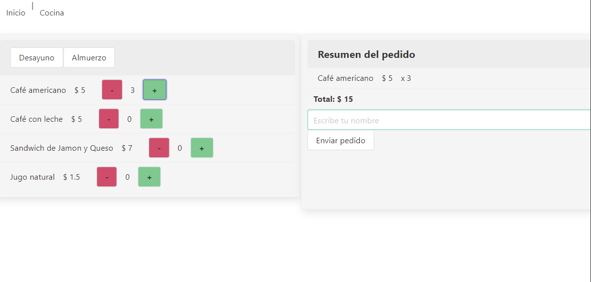

# Burger Queen 🍔

## Project Summary 📌

Restaurant interface (SPA) made for waiters and kitchen personal. It allows them to create orders with the client name and chosen products and send them to the kitchen page.

<br />

## Learning goals 📚

This is the first project I made on Vue.js, so I learned the basics through this. Also I reinforced firebase integration.

<br />


## UI Design 	📱

It is designed for tablet but I hope to include other devices in the future. 



<br />

## Tools:  🛠️ 

Vue.js and Firebase.

<br />


## Future updates 🎯

To improve css styles

<br />

# Commands 👩‍💻
## Project setup
```
npm install
```

### Compiles and hot-reloads for development
```
npm run serve
```

### Compiles and minifies for production
```
npm run build
```

### Lints and fixes files
```
npm run lint
```

### Customize configuration
See [Configuration Reference](https://cli.vuejs.org/config/).


